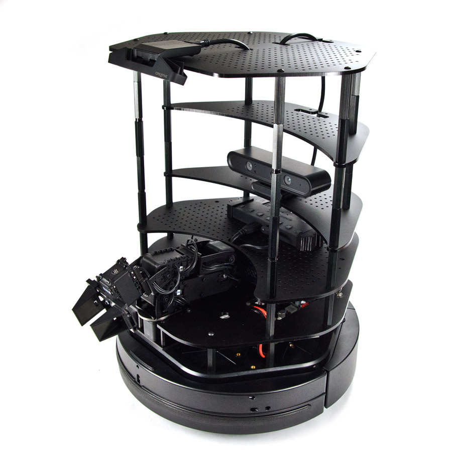

# Robot Control System with ROS-2 and OpenCV

## Description
This repository contains a Python implementation for a robot control system using ROS (Robot Operating System) and OpenCV. The robot is programmed to detect and follow an object using computer vision techniques.

The main script processes images from a camera to detect an object and adjusts the robot's movements accordingly to follow it. This setup leverages ROS for communication and control and OpenCV for image processing.

## TurtleBot 2

  

## Installation
  1. Clone the repository: `git clone https://github.com/KhalidMustafaElenani/TurtleBot-Object-Tracker.git`
  2. Navigate to the project directory: `cd TurtleBot-Object-Tracker`

## Usage Examples
  1. Ensure ROS is running:
         `roscore`
  3. Launch vision nodes:
         `roslaunch rchomeedu_vision multi_astra.launch`
         `roslaunch robot_vision_openvino yolo_ros.launch`
  4. Launch robot nodes:
         `roslaunch jupiterobot_bringup jupiterobot_bringup.launch`
  5. Run the robot control script:
         `python robot_control_script.py`
     
## Code Overview
**`Robot_Control_Script.py`**: 
  - Uses OpenCV to process images and detect objects.
  - Uses ROS to control the robot based on object detection.

## Notes
  For detailed setup instructions and execution, refer to the [NOTES.md](NOTES.md).
